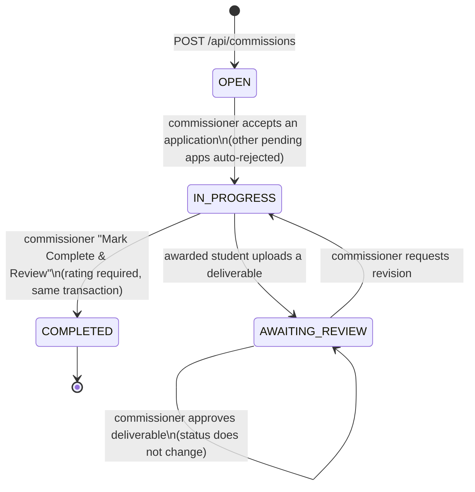

# CarsuComits — Architecture

A commission marketplace for Caraga State University students. One user posts a paid task (a "commission"), other users apply, the poster picks one applicant, work is delivered and reviewed, and both sides rate each other.

This document describes the code **as it is**, including the parts that don't work. Security findings are listed briefly under [Fragile or confusing](#fragile-or-confusing); AUDIT.md has the full list.

---

## Stack

| Layer | Choice |
|---|---|
| Framework | Next.js 15.5 (App Router), React 19, TypeScript (strict) |
| Styling | Tailwind CSS 3, a few component classes in `src/app/globals.css` (`btn-primary`, `input`, `card`, `pill`…) |
| Database | PostgreSQL (hosted on Neon) through Prisma 5.22 |
| File storage | Vercel Blob (`@vercel/blob`): avatars, cover images, deliverables (all `access: "public"`) |
| Auth | Hand-rolled cookie session (`src/lib/session.ts`), bcryptjs password hashes, optional TOTP MFA (`otpauth`, `qrcode`) |
| Icons | lucide-react |
| Tests | **None.** No test runner, no test files |
| Hosting | Vercel, auto-deploy on push to `main` |

There is no middleware, no API validation library, no global error or 404 page, and no email sending.

## Folder structure

```
prisma/
  schema.prisma        # the only schema source; no migrations folder
  seed.mjs             # creates/resets the admin account
src/
  app/
    page.tsx, browse/, commission/[id]/, u/[id]/, saved/, about/, login/, register/   # public-ish pages
    (dashboard)/       # route group with sidebar + topbar layout
      dashboard/, hub/, profile/, messages/, reports/
      commissioner/{,listings,applicants,post}/
    admin/             # admin layout with role guard
      page.tsx, users/, listings/, reports/, logs/, security/, settings/
    api/               # route handlers (all JSON; uploads use multipart)
  components/          # UI; client components fetch the API directly
  lib/
    db.ts              # Prisma singleton
    session.ts         # cookie session read/write
    queries.ts         # user stats, reviews, rating distribution
    notifications.ts   # notify() → Notification row
    trust.ts           # trust-tier badge from avg rating + review count
    mfa.ts             # TOTP + backup codes
    mock-data.ts       # hard-coded fake commissions (still used by the landing page)
    types.ts           # string unions left over from the SQLite era
```

## Roles

`Role` enum: `STUDENT_EMPLOYEE`, `COMMISSIONER`, `ADMIN`.

| Role | How you get it | What it actually gates |
|---|---|---|
| `STUDENT_EMPLOYEE` | Default on `/register` | Nothing specific. Can post **and** apply |
| `COMMISSIONER` | Only if a client sends `role: "COMMISSIONER"` to `/api/auth/register`. The register form never does | Nothing. Treated exactly like a student |
| `ADMIN` | Only via `npm run db:seed` (one hard-coded account) | `/admin/*` layout guard, `/api/admin/*` handlers. Admins are redirected out of the `(dashboard)` group |

In practice there are two roles: "user" and "admin". Posting vs. applying is decided per commission: you're the commissioner of what you posted and an applicant on what you applied to.

## Auth and sessions

- **Login** (`/api/auth/login`): looks up the email (case-sensitive), rejects `BANNED`/`SUSPENDED`, checks bcrypt, enforces the Student/Admin tab choice, then asks for a TOTP or backup code if `mfaEnabled`. Writes a `LOGIN` audit row.
- **Session cookie** `carsu_session` holds `base64(JSON.stringify({ userId, fullName, email, role }))`. It is httpOnly, `SameSite=Lax`, and lasts 7 days. **It is not signed or encrypted.** `AUTH_SECRET` is documented but never read.
- **Session use:** every page and API route calls `getSession()` and trusts the cookie's `userId` and `role`. It never re-reads the user from the database, so bans, suspensions, and role changes don't take effect until the cookie expires.
- **Route protection:**
  - `admin/layout.tsx` redirects non-admins.
  - `(dashboard)/layout.tsx` redirects admins to `/admin`, but **lets logged-out visitors in** as "Guest". Each page then shows a "please log in" message or empty data.
  - `/saved` handles logged-out visitors inline the same way.
- **MFA:** `/api/auth/mfa/{setup,enable,disable}` work for any signed-in user. The setup UI only exists at `/admin/security`.
- **Registration:** requires an `@carsu.edu.ph` suffix and 8+ character password, then signs the user in immediately. Email verification and password reset were removed in commit `7d4237e`, but their columns and the `PasswordResetToken` table remain.

## Main user flows

### Commission lifecycle



`CANCELLED` and `DISPUTED` exist in the enum but nothing sets them. Commissions can't be edited, cancelled, or deleted.

**Known dead end:** approving a deliverable leaves the commission in `AWAITING_REVIEW`, but `/complete` only accepts `IN_PROGRESS`, and the hub only shows "Mark Complete" for `IN_PROGRESS`. Once a deliverable is approved, the commission can never be completed.

### Flows by role

**Visitor**
- The landing page `/` shows hard-coded mock commissions from `lib/mock-data.ts`. Their links (`/commission/c1`…) 404.
- `/browse` lists real `OPEN` commissions via `/api/commissions`.
- `/commission/[id]` and `/u/[id]` are public.
- `/login` and `/register` complete the visitor flows.

**Signed-in user**
1. **Post:** `/commissioner/post` → `POST /api/commissions` → optional cover upload → redirect to the detail page.
2. **Apply:** detail page → Apply modal (optional cover letter) → `POST /api/commissions/[id]/apply` → the commissioner gets a notification.
   - A `PENDING` application can be withdrawn.
   - The `@@unique([commissionId, applicantId])` constraint means you can never apply to the same commission again, even though the withdraw dialog says you can.
3. **Hire:** `/commissioner/applicants` → Accept (in a transaction: accept one, reject the other pending ones, commission → `IN_PROGRESS`, `awardedToId` set) or Decline.
4. **Deliver:** the awarded student uploads files on the commission page → `AWAITING_REVIEW`. The commissioner approves or requests a revision.
5. **Complete:** "Mark Complete & Review" on `/hub` or `/dashboard` → `POST /complete`. This creates the rating and sets `COMPLETED`.
   - **Auto-flag:** if the ratee's average drops below 3.0 with at least 2 ratings, they're set to `WARNED` and an `AUTO_FLAG_LOW_RATING` audit row is written.
   - **Retroactive rating:** `/rate-now` covers completed commissions with no rating.
6. **Rate back:** the awarded student rates the commissioner on `/hub` via `/api/ratings/commissioner`.
7. **Other features:**
   - Messages: `/messages`, polling every 5–10 s.
   - Notifications: bell popover, polling every 30 s.
   - Saved commissions: `/saved`.
   - Reports: `/reports`. You report a user by their **email address**, and the reported user can see who filed the report.
   - Profile: `/profile` covers avatar and skills. There is no way to edit name or bio.

**Admin** (`/admin/*`, one seeded account)
- **Dashboard:** KPI cards, users with open reports, pending reports.
- **Users:** search; Warn / Suspend / Ban / Reinstate through `/api/admin/users/[id]/action`, which writes an audit row.
- **Listings:** read-only table with status filters.
- **Reports:** Resolve / Escalate / Reopen, with an audit row.
- **Logs:** latest 200 `AuditLog` rows.
- **Security:** TOTP MFA setup.
- **Settings:** a **non-functional** form; "Save" just shows a checkmark.

### Payments

There is **no payment data**. `fareMin`/`fareMax`/`fareUnit` is an advertised price range. No agreed amount is recorded when an applicant is accepted (`proposedRate` exists on `Application` but no UI sets it), and no money moves through the platform.

## Data model

All in `prisma/schema.prisma`. IDs are `cuid()` strings.

| Model | Purpose | Notes |
|---|---|---|
| `User` | Account | `role`, `status` (`ACTIVE/WARNED/SUSPENDED/BANNED`), `bio`, `avatarUrl`, MFA fields, unused email-verification fields |
| `Skill` | User's self-declared skills | name + `SkillLevel` |
| `Commission` | A posted task | `category` (`ACADEMIC/TECHNICAL/GENERAL_ERRANDS/ADMINISTRATIVE`), free-text `subcategory`, `requiredLevel`, fare range, `deadline`, `status`, `commissionerId`, `awardedToId` (plain string, **no relation/FK**) |
| `Application` | User applies to a commission | unique per (commission, applicant); `status` `PENDING/ACCEPTED/REJECTED/WITHDRAWN` |
| `Rating` | 1–5 stars + comment | unique per (commission, rater, ratee). Upserted, so it can be overwritten |
| `Message` | Direct message | optional `commissionId`; `readAt` |
| `Report` | User-on-user report | `reason` free text; `status`; `resolvedById` (no relation) |
| `Notification` | In-app notification | `type` free string |
| `AuditLog` | Action log | `actorId`, `action` string, `target` string, `meta` JSON string. No before/after fields; rows can be updated or deleted like any table |
| `SavedCommission` | Bookmark | unique per (user, commission) |
| `Deliverable` | File submitted by awarded student | Blob URL, name, size, message, review status |
| `PasswordResetToken` | Unused since the reset feature was removed | |

**Schema management:** there is no `prisma/migrations` directory. The schema reaches the database through `prisma db push`, run by hand (see SETUP.md / DEPLOY.md). The Vercel build only runs `prisma generate`, so a schema change that isn't pushed to Neon first breaks production at runtime.

## Environment variables

| Variable | Used by | Required |
|---|---|---|
| `DATABASE_URL` | Prisma | Yes |
| `BLOB_READ_WRITE_TOKEN` | `@vercel/blob` for all uploads | Yes, for uploads. Injected automatically on Vercel |
| `AUTH_SECRET` | **Nothing.** Documented in `.env.example`, never read | — |

## Deployment

- **Vercel:** watches `main` and runs `npm run build` (`prisma generate && next build`). No `vercel.json`.
- **Database (Neon Postgres):** DEPLOY.md recommends using the same database for local dev and production.
- **Uploads:** Vercel Blob store connected in the Vercel dashboard.
- **Admin account:** `npm run db:seed` upserts `glen.licayan@carsu.edu.ph`. Re-running it **resets that account's password to `123456`**, and the credentials are printed in README, SETUP, DEPLOY, and the seed file.
- **Doc drift:** SETUP.md and DEPLOY.md say the code lives in an `app/` subfolder (it's the repo root), give `svllynx/carsucomits` as the clone URL (the remote is `Lix-seri/carsucomits`), and mention Next 15.0.3.

## Fragile or confusing

**Security**
1. **The session cookie can be forged.** It's unsigned base64 JSON, so anyone can write `{"userId":"<any id>","role":"ADMIN"}`, base64 it, and become any user or an admin. This is the single biggest problem in the codebase.
2. **Sessions are never re-checked against the database.** Banning or suspending someone doesn't log them out, and they can keep posting, applying, and messaging for up to 7 days.
3. **Roles are cosmetic** apart from admin. `STUDENT_EMPLOYEE` and `COMMISSIONER` gate nothing.
4. **Admin credentials are public.** The seed password `123456` is in four committed files.

**Broken or fake features**

5. **Landing page shows fake data** whose "Apply Now" links 404. One mock item is "Research Paper Writing", which the planned no-academic-work rule forbids.
6. **Dead links:** `/help` (header), `/post`, `/how-it-works`, `/pricing`, `/safety`, `/terms`, `/privacy` (footer). There's no custom 404 page.
7. **Deliverable-approve dead end.** See the lifecycle section above.
8. **Hard-coded UI values:**
   - Sidebar: `★ 4.8 · Verified` for everyone.
   - Profile: "Verified Student", "Student Employee · CSU Caraga".
   - Admin sidebar: "Admin USG / System Administrator".
   - No-op controls: the admin bell with a permanent red dot, the topbar "Filter" button, and the whole `/admin/settings` page.

**Code health**

9. **Dead code:**
   - `components/modals/post-commission-modal.tsx`, and `modal-shell.tsx` (only used by that modal).
   - `lib/types.ts`, which still mentions SQLite.
   - Email-verification columns and the `PasswordResetToken` table.
10. **Native dialogs:** 14 `alert()` / `confirm()` / `prompt()` calls across 8 files.
11. **Copy-paste:**
    - `fareDisplay()` exists in 7 places.
    - Category/status colour maps are redefined per page.
    - `timeAgo()` exists 3 times.
    - The three rating modals are near-identical.
12. **Loose typing and weak data integrity:**
    - Notification types are reused loosely; a new message is `APPLICATION_RECEIVED`.
    - `Commission.awardedToId` and `Report.resolvedById` are unconstrained strings, so the database can't guarantee they point at real users.
13. **Performance:**
    - N+1 queries: per-row rating aggregates on admin users, applicants, admin dashboard, and search.
    - `lib/db.ts` logs **every SQL query** in production.
14. **Naming:** the university appears as "Caraga State University", "CSU Caraga", "CSU Main", "CSU Marketplace", and "CSU" across the UI, and one browse empty-state message is in Filipino.

**Missing tooling**

15. **No tests, no lint config file, no CI.** `npm run lint` uses `next lint` defaults.
